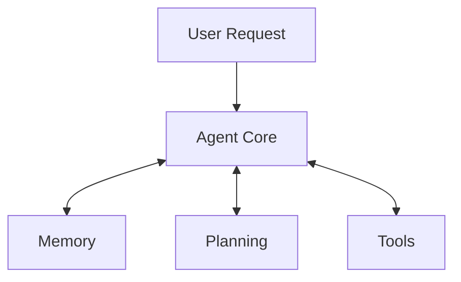

# Agent Examples

## Table of Contents

- [About](#about)
- [Getting Started](#getting_started)
- [Usage](#usage)
- [Contributing](../CONTRIBUTING.md)

## About `<a name = "about"></a>`

This repository is meant to contain a curated collection of diverse AI agent examples, showcasing various techniques and frameworks. In general AI agents are programs that can perceive their environment, make decisions, and act upon the environment. Within this repository, we will be focusing on LLM-based agents that are accessible via a chat interface. These agents will be able to interact with the user, and provide information or perform tasks based on the user's input.

We are using the following architecture for the AI agents:



The `Agent Core` is the main component of the AI agent, and is responsible for processing the user's request, and generating a response. The `Memory` component is responsible for storing information about the interaction with the user, and the `Planning` component is responsible for generating a plan of action based on the user's request. The `Tools` component contains various tools that the agent can use to gather information or perform tasks.

This repository is meant to be used as a reference for developers who are looking to learn more about AI agents in the LLM context, or are looking to implement their own agents.

## Concepts

### Tools

#### Simple Function Calling

This represents the most fundamental type of tools, wherein the LLM interface utilized by the agent incorporates support for tool functionality—essentially, a callable function. The agent can leverage this tool to execute a diverse array of tasks, including retrieving data from a database or dispatching an email.

This concept is covered in the following agent examples:

- [OpenAI](openai-example)
- [LangChain](langchain-example)
- [Anthropic](anthropic-example)

### Memory

#### Running State

This concept involves the agent maintaining a running state, which is updated as the agent interacts with the user. The state is used to store information about the user's request, and is updated as the agent processes the request. The state can be used to store information about the user's request, such as the user's name, the user's location, or the user's preferences and use case specific information.

The update is usually done in a seperate LLM call, in which the latest conversation history and the current state is passed to the LMM model. The model then updates the state based on the conversation history and the current state.

This concept is covered in the following agent examples:

- [LangChain](langchain-example)

## Getting Started `<a name = "getting_started"></a>`

These instructions will get you a copy of the project up and running on your local machine for development and testing purposes. See [deployment](#deployment) for notes on how to deploy the project on a live system.

### Prerequisites

All agent examples are based on Python, so you will need to have Python installed on your machine. You can download Python from the official website [here](https://www.python.org/downloads/). Furthermore, we utilize [Poetry](https://python-poetry.org/) for managing dependencies, so you will need to have Poetry installed on your machine. You can find more information about how to install Poetry [here](https://python-poetry.org/docs/#installation).

### Installing

Each agent example is contained within its own directory within the `agents` directory, and has a corresponding `pyproject.toml` file. You can install the dependencies for each agent by running the following command within the agent's directory:

```bash
poetry install
```

## Usage `<a name = "usage"></a>`

### Agents with Streamlit Interface

To run an agent with a Streamlit interface, you can use the following command within the agent's directory:

```bash
poetry run streamlit run <path_to_agent_file>
```

For example, to run the `openai` agent, you can run the following command:

```bash
poetry run streamlit run openai_example/main.py
```

Note: Each agent example may have additional instructions in its respective README file. Furthermore, you will need to
define some environment variables to run the agents. Please refer to the respective `.env.example` file for more information.

## Recommended Learning Resources

- [NVIDIA: Building RAG Agents with LLMs](https://learn.nvidia.com/courses/course-detail?course_id=course-v1:DLI+S-FX-15+V1)
